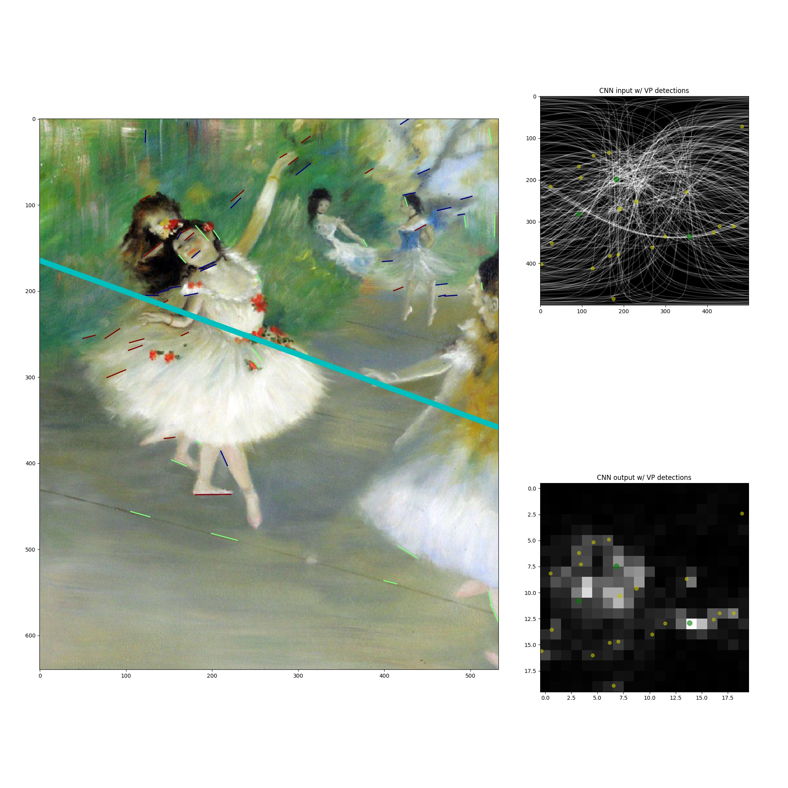
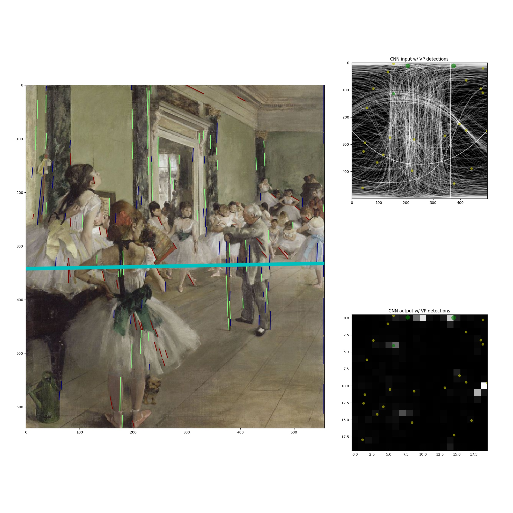
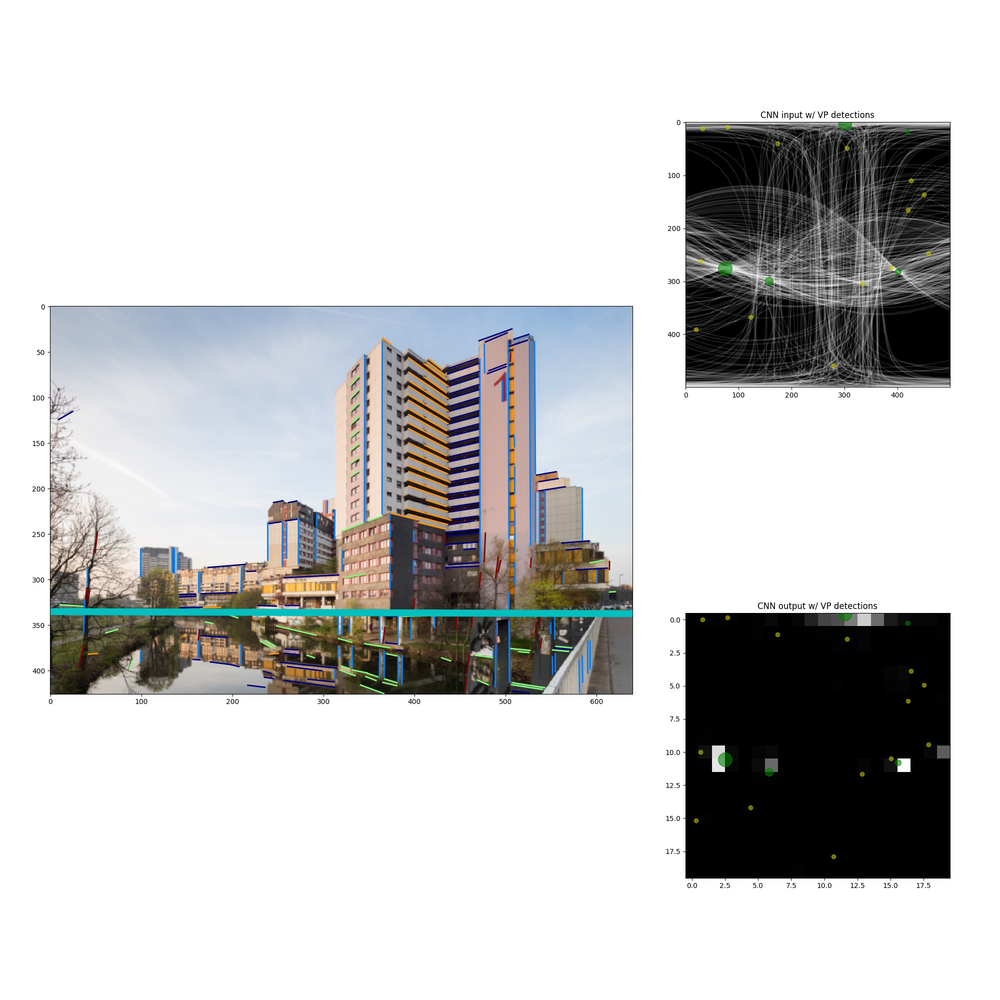
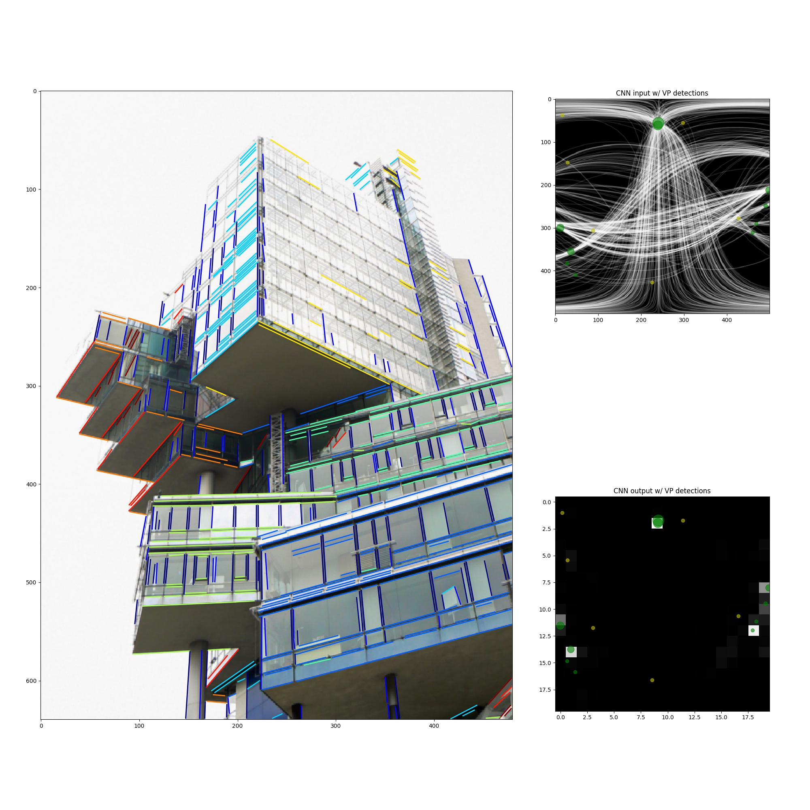

## Deep Learning for Vanishing Point Detection Using an Inverse Gnomonic Projection

### Requirements
* Anaconda w/ Python 2.7
* [Caffe 1.0-RC5](https://github.com/BVLC/caffe/tree/rc5)
* ImageMagick 6.8.8-1
    ```
    apt install imagemagick
    ```
* what ``requirements.txt`` says

### Setup
* Launch a docker container from https://hub.docker.com/r/bvlc/caffe (Python 2.7 + Caffe)
    ```
    docker pull bvlc/caffe:cpu
    ```
    or any other suitable tag, e.g.:
    ```
    docker pull bvlc/caffe:gpu
    ```
* Initialize the repository
    ```
    git clone https://github.com/Davidelanz/vanishing_points.git
    cd vanishing_points
    pip install -r requirements.txt
    ```
* Download the [CNN weights and image mean files](https://drive.google.com/open?id=1VBBszbCWuVEQ0a7DKVqZNngRsk1Zorei) and 
put them into the ``cnn`` folder.
* Adjust ``config.py`` so that it contains the path to your Caffe installation and the paths where you store 
the [benchmark datasets](#datasets).


### Run
#### Examples
You can run the vanishing point detector on the example images and visualise the results. 
Computation may take a few moments. Adjust with the GPU ID if necessary:
``` 
python main.py
```

### Examples









### References

The code provided here was adapted from:
```
@inproceedings{kluger2017deep,
  title={Deep learning for vanishing point detection using an inverse gnomonic projection},
  author={Kluger, Florian and Ackermann, Hanno and Yang, Michael Ying and Rosenhahn, Bodo},
  booktitle={German Conference on Pattern Recognition (GCPR)},
  year={2017}
}
```
The paper can be found on [arXiv](https://arxiv.org/abs/1707.02427).

The benchmark datasets used in the paper can be found here: <a name='datasets'></a>
* [York Urban Dataset](http://www.elderlab.yorku.ca/resources/york-urban-line-segment-database-information/)
* [Eurasian Cities Dataset](http://graphics.cs.msu.ru/en/research/projects/msr/geometry)
* [Horizon Lines in the Wild](http://www.cs.uky.edu/~jacobs/datasets/hlw/)
